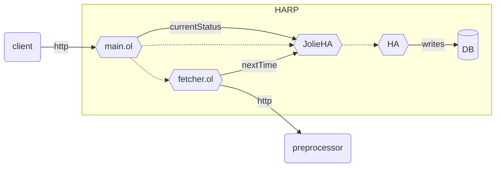

# Jolie wrapper for Hypothetical Answers

This repository contains jolie service with Hypothetical Answers application.

## Architecture




## Available parameter

```json
{
    "name": "", // name of the instance
    "queries": [
        {"name": "queryname"}
    ], // arrays of available queries
    "fetcher": {
        "target": "", // destination to poll data from
        "period": 1000 // interval period for each call (in ms)
    },
    "dbConnection": "dbconnectionstring", // database connection for HA / for currentStatus operation
}
```

## Usage

```bash
$ mvn install // complies Javaservice
$ npm run start // launch the program
```
